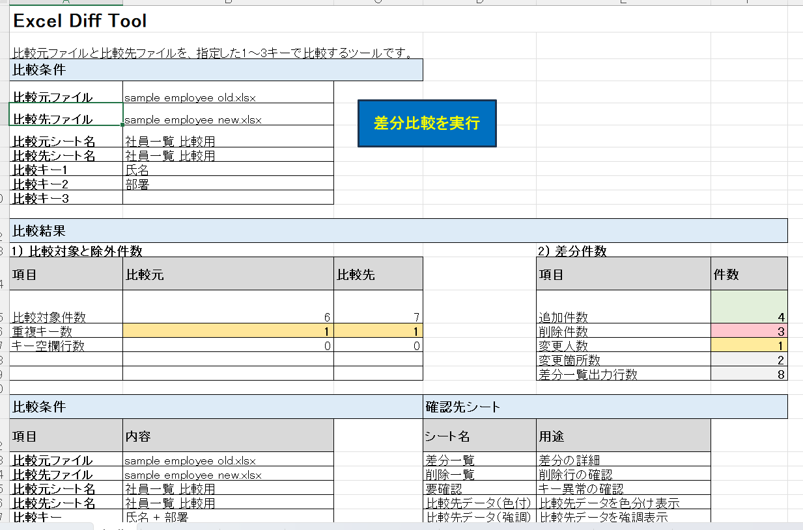
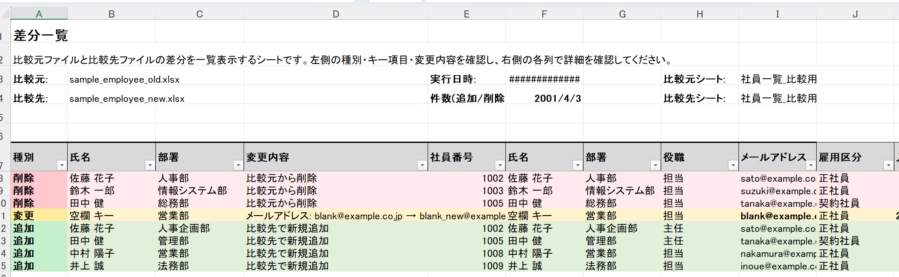

# Excel Diff Tool

Excelファイル同士を比較し  
**追加 / 削除 / 変更** を自動検出するVBAツールです。

社員名簿・商品マスタ・売上データなど  
**どんなExcel表でも差分比較できます。**

---

# ツール画面



---

# 差分結果



---

# 特徴

- ヘッダー自動検出
- 比較キー 1〜3項目
- 差分の色表示
- 強調表示（視認性重視）

---

# Quick Example（まず動きを理解）

このツールの動きを  
サンプルデータで説明します。

## 比較元ファイル

|社員番号|氏名|部署|
|---|---|---|
|1001|山田|営業|
|1002|佐藤|人事|
|1003|鈴木|総務|

## 比較先ファイル

|社員番号|氏名|部署|
|---|---|---|
|1001|山田|営業|
|1002|佐藤|経理|
|1004|田中|営業|

## 比較キー

社員番号

## 実行

Excelツールを開き  
**「差分比較を実行」ボタン**をクリックします。

---

# 出力結果

|区分|社員番号|変更内容|
|---|---|---|
|変更|1002|部署 人事 → 経理|
|削除|1003|比較元から削除|
|追加|1004|比較先で新規追加|

---

# 必要環境

- Microsoft Excel
- マクロ有効

---

# License

MIT License